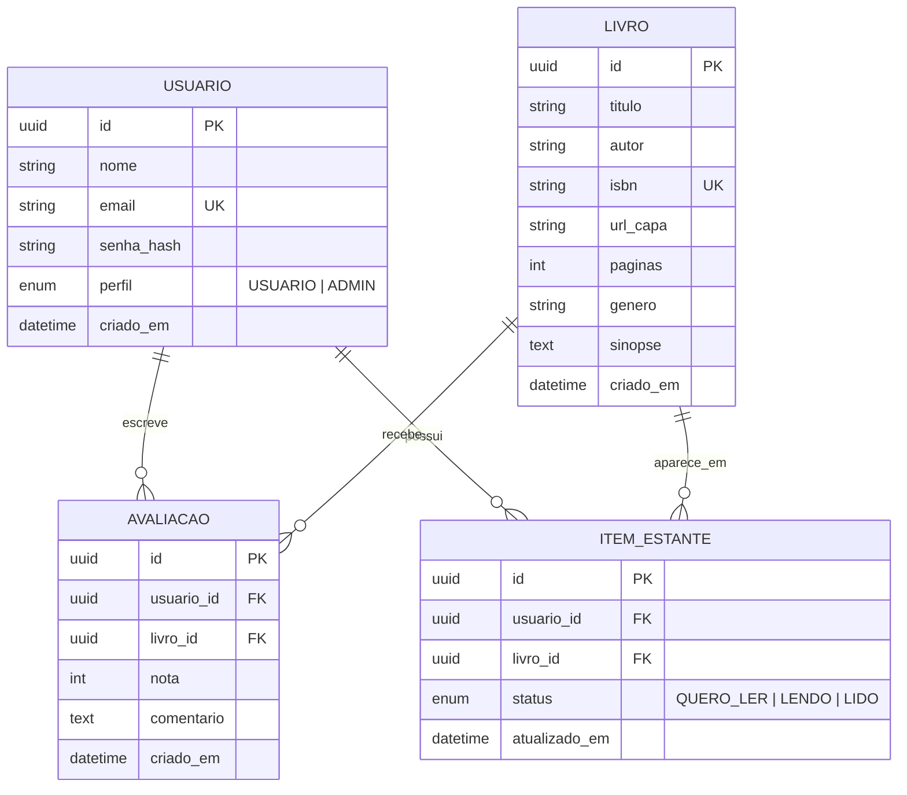

# Estante API

API REST em Node.js para catálogo de livros, avaliações e estante de leitura.

## Sobre o sistema

Leitores cadastram livros no catálogo, organizam sua estante pessoal (quero ler, lendo, lido) e avaliam os livros que já leram. Sistema da categoria **reviews**.

**API externa:** Open Library (busca de dados do livro por título para preencher o cadastro). _(a implementar)_

## Entidades

- **Usuário**: perfil `USUARIO` ou `ADMIN`.
- **Livro**: título, autor, ISBN, capa, páginas, gênero, sinopse.
- **Avaliação**: nota (1 a 5) e comentário de um usuário sobre um livro.
- **Item da estante**: status do livro para o usuário (`QUERO_LER`, `LENDO`, `LIDO`).

## DER



`AVALIACAO` e `ITEM_ESTANTE` têm par único (`usuario_id`, `livro_id`).

## Regras de negócio e permissões

- Um usuário avalia um livro uma única vez, e só se ele estiver como `LIDO` na estante.
- O dono edita e exclui a própria avaliação; o `ADMIN` exclui qualquer uma.
- Só o `ADMIN` cadastra, edita e remove livros.
- A média das notas do livro é calculada a partir das avaliações.

## Como executar

Pré-requisitos: Docker e Docker Compose.

```bash
cp .env.example .env
# edite o .env e troque as senhas e o segredo JWT
docker-compose up --build
```

Verificação: `GET http://localhost:3000/saude` deve retornar `{"status":"ok"}`.
Caixa de e-mails de teste (Mailpit): http://localhost:8025

## Estrutura (Clean Architecture)

```
src/
  dominio/          entidades e regras de negócio puras
  aplicacao/        casos de uso e interfaces (repositórios, serviços)
  infraestrutura/   banco, e-mail, API externa
  apresentacao/     rotas, controllers, middlewares (erros globais)
```

## Status

Semana 1: estrutura inicial, DER e ambiente Docker.
